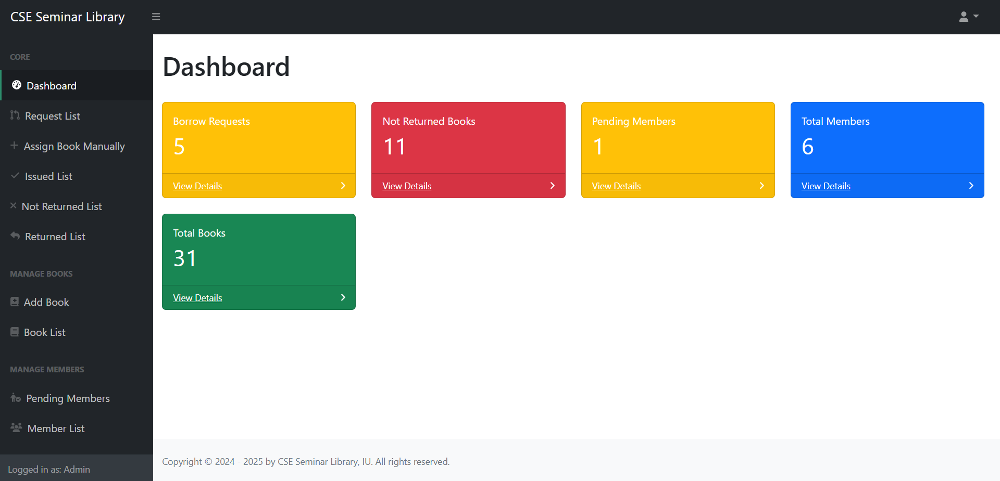

# Library Management System

## Introduction
The **Library Management System** is a web-based application built with Laravel that helps manage book records, user accounts, borrowing transactions, and return processes efficiently. It is designed for administrators, teachers, and students to manage library operations smoothly.

## Features
Here are the main features of this Library Management System:
1. The system supports three types of users: Admin, Teacher, and Student.
2. Students can create accounts, but their accounts remain pending until approved by an Admin.
3. Upon approval, students can request to borrow books.
4. Teachers have the same privileges as students.
5. Admins can approve or reject account creation requests from students and teachers, as well as manage book borrowing requests.
6. Admin can assign books manually to a user.
7. Admins can upload and update book information.
8.	Admins can edit user information, with the exception of passwords.
10.	Admins can manage and update other necessary system settings.

## Technologies Used
- **Frontend**: HTML, CSS, Bootstrap 5, and JavaScript
- **Backend**: Laravel 11
- **Database**: MySQL

## Screenshots of the Project

### Registration & Login Form

<p align="center">
   
</p>

<p align="center">
   
</p>

<p align="center">
   
</p>


### User Views
<p align="center"><b>Home Page</b></p>
<p align="center">   
   
</p>

<p align="center"><b>Book Details Page</b></p>
<p align="center">
   
</p>

<p align="center"><b>Search Results Page</b></p>
<p align="center">
   
</p>

<p align="center"><b>My Profile</b></p>
<p align="center">
   
</p>

<p align="center"><b>My Requested Book List</b></p>
<p align="center">
   
</p>

<p align="center"><b>My Borrowed Book List</b></p>
<p align="center">
   
</p>

<p align="center"><b>My Returned Book List</b></p>
<p align="center">
   
</p>

### Admin Panel
<p align="center"><b>Dashboard</b></p>
<p align="center">
   
</p>

<p align="center"><b>Request List</b></p>
<p align="center">
   
</p>

<p align="center"><b>Assign Book Manually</b></p>
<p align="center">
   
</p>

<p align="center"><b>Issued Book List</b></p>
<p align="center">
   
</p>

<p align="center"><b>Returned List</b></p>
<p align="center">
   
</p>

<p align="center"><b>Add Book</b></p>
<p align="center">
   
</p>

<p align="center"><b>Book List</b></p>
<p align="center">
   
</p>

<p align="center"><b>Pending Members</b></p>
<p align="center">
   
</p>

<p align="center"><b>Member List</b></p>
<p align="center">
   
</p>

## Installation
### Requirements
Ensure your server meets the following requirements:
- PHP 8.2+
- MySQL 5.7+
- Composer
- Laravel 11
- Apache

### Setup Instructions
1. **Clone the repository:**
   ```sh
   git clone https://github.com/nazmulhossin/library-management-system.git
   cd library-management-system
   ```

2. **Install dependencies:**
   ```sh
   composer install
   ```

3. **Configure environment variables:**  
   Copy the `.env.example` file to `.env` and update database, mail, and session configurations:  

   For Linux/macOS:
   ```sh
   cp .env.example .env
   ```
   For Windows (Command Prompt):
   ```sh
   copy .env.example .env
   ```
   Edit the `.env` file:
   ```env
   
   # Database Configuration
   DB_CONNECTION=mysql
   DB_HOST=127.0.0.1
   DB_PORT=3306
   DB_DATABASE=LMS_DB
   DB_USERNAME=root
   DB_PASSWORD=your_password
    
   # Mail Configuration
   MAIL_MAILER=smtp
   MAIL_HOST=smtp.gmail.com
   MAIL_PORT=587
   MAIL_USERNAME=your_email@example.com
   MAIL_PASSWORD=your_email_password
   MAIL_ENCRYPTION=tls
   MAIL_FROM_ADDRESS="your_email@example.com"
   MAIL_FROM_NAME="CSE Seminar Library"
    
   # Session Configuration
   SESSION_DRIVER=file
   SESSION_LIFETIME=43200
   SESSION_ENCRYPT=false
   SESSION_PATH=/
   SESSION_DOMAIN=null
   ```

4. **Run database migrations and seed data:**
   ```sh
   php artisan migrate --seed
   ```

5. **Setup Storage Symlink:**
   ```sh
   php artisan storage:link
   ```

6. **Start the Laravel development server:**
   ```sh
   php artisan serve
   ```

## Usage
- **Admin Dashboard**:
     - Email: `admin@gmail.com`
     - Password: `12345678`
